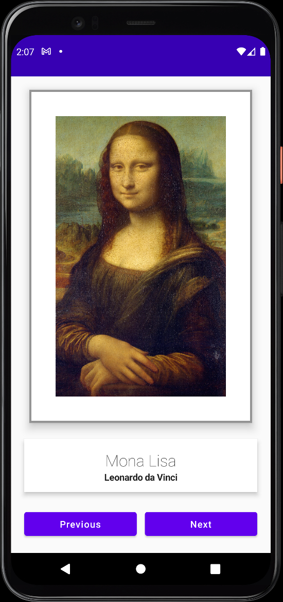

## Table of contents

- [Overview](#overview)
    - [The challenge](#the-challenge)
    - [Screenshot](#screenshot)
- [My process](#my-process)
    - [Built with](#built-with)
    - [What I learned](#what-i-learned)
    - [Continued development](#continued-development)
- [Author](#author)

## Overview

### The challenge

Users should be able to:

- Click on the buttons and select the correct layout: vertical, horizontal or grid
- Navigate through the layouts scrolling the screen and visualizing the images and descriptions of the items

### Screenshot

### Links

- Solution URL: [Solution](https://github.com/mlzzi/Dogglers-app)

## My process

### Built with

- Android Studio
- Kotlin

### What I learned

This is the second Project Challenge done on the Developer`s Google Learn website from the Course 'Android Basics in Kotlin'

### Continued development

I will continue to learn from the Google's platform and from Jetbrain's platform Hyperskill

## Author

- Linkedin - [Murilo Luzzi](https://www.linkedin.com/in/muriloluzzi/)
- GitHub - [@mlzzi](https://github.com/mlzzi)